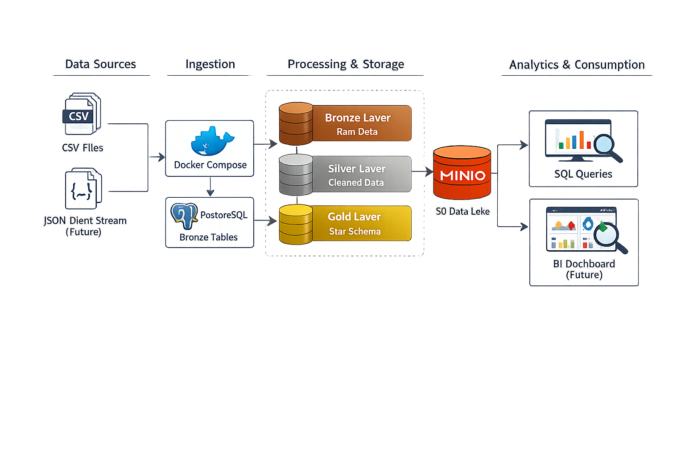
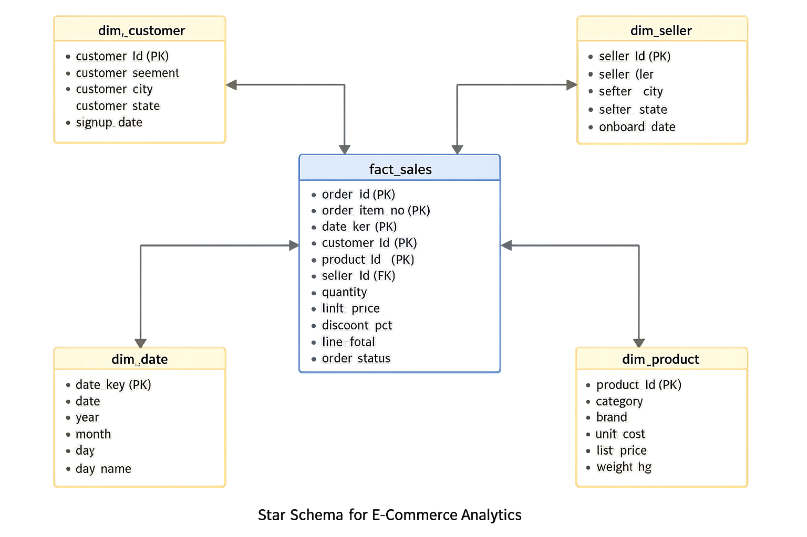

# E-Commerce Lakehouse (Local) — Batch + Star Schema (V1)

This project is an end-to-end data engineering portfolio build that simulates a real-world e-commerce analytics platform. It implements a local lakehouse + warehouse pattern using Docker and WSL2, and models analytics data using a Gold-layer star schema.

## Architecture (V1)

## Results (V1)
- Total delivered revenue: **8,739,337.18**
- Top category by delivered revenue: **Books — 1,015,234.95**
- Top customer segment by delivered revenue: **Consumer — 5,990,753.26**

- **Bronze (raw):** source CSV files loaded as-is into Postgres bronze tables and stored in MinIO under `bronze/ecom/raw/`
- **Silver (clean):** typed/casted tables (dates, numerics, booleans)
- **Gold (analytics):** star schema (dimensions + fact table) optimized for BI-style queries

## Data model (Gold star schema)

**Fact table**
- `gold.fact_sales` (grain: 1 row per order item)

**Dimensions**
- `gold.dim_date`
- `gold.dim_customer`
- `gold.dim_product`
- `gold.dim_seller`

## How to run (local)
See: `docs/runbook/local_setup.md`

## Roadmap
- **V2:** Streaming + orchestration
- **V3:** Data quality + observability
- **V4:** Cloud migration blueprint + CI
